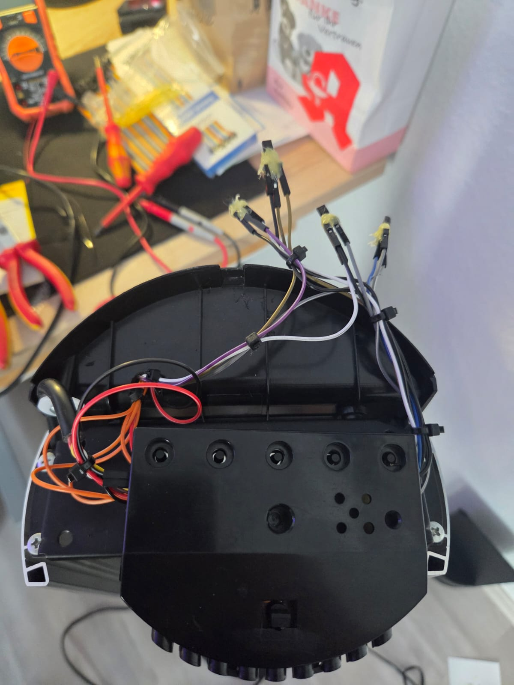

# ESP32-S3 Honeywell HO-5500RE Ventilator Smart

Ein Umbau des **Honeywell HO-5500RE Turmventilators** mit einem **ESP32-S3-Zero**, um die vorhandene Tastensteuerung per WLAN zu bedienen, den Gerätezustand über die vorhandenen LEDs zurückzulesen und zusätzliche Funktionen wie einen eigenen Sleep-Timer, OTA-Updates und eine Weboberfläche bereitzustellen.

Das Ziel des Projekts war ausdrücklich **nicht**, die originale Steuerplatine zu ersetzen. Stattdessen bleibt die Honeywell-Elektronik vollständig erhalten: Der ESP32 betätigt die vorhandenen Taster elektronisch und liest die vorhandenen Status-LEDs als Feedback ein.

> **Projektstatus:** Final / funktionsfähig  
> **Firmware:** `5.0.0-FINAL`  
> **Controller:** ESP32-S3-Zero


## Features

- WLAN-Weboberfläche für **Ein/Aus**, **Speed 1–3**, **Drehen**, **Normal**, **Breeze** und **Night**
- Elektronische Tastenbetätigung über **2N7000 N-Kanal-MOSFETs**
- LED-Feedback über fünf ADC-Eingänge des ESP32-S3
- Robuste Zustandsmessung mit synchronisierten Mehrkanal-Samples
- Erkennung von **Aus**, **Speed 1/2/3** und den Moduskombinationen
- Kalibrierung und automatische Trennschärfeanalyse
- 9 Kombinationsprofile: `3 Geschwindigkeiten × 3 Modi`
- Persistente Kalibrierdaten im NVS/`Preferences`
- Backup/Import der Kalibrierung über die Weboberfläche
- Manueller Button **„Status jetzt aus LEDs übernehmen“**
- Einmaliger LED-Startabgleich nach dem Einschalten
- Eigener Sleep-Timer bis 4 Stunden
- OTA-Firmwareupdates direkt im Browser
- Fallback-Access-Point bei nicht erreichbarem WLAN
- Schnelle „optimistische“ Weboberfläche: Tastendrücke werden sofort optisch dargestellt

## Projektbeschreibung

Der HO-5500RE besitzt eine eigene Steuerplatine mit fünf Tastern und mehreren Status-LEDs. Der ESP32 wird parallel an die Taster angebunden. Ein GPIO steuert jeweils das Gate eines 2N7000; der MOSFET simuliert den originalen Tastendruck, ohne die vorhandene Bedienung zu entfernen.

Die Statusrückmeldung war der aufwendigste Teil des Projekts. Die LEDs werden nicht wie fünf voneinander unabhängige statische Signale angesteuert, sondern zeigen ein deutlich gemultiplextes bzw. gemeinsam driftendes Signal. Einzelne `analogRead()`-Werte waren deshalb nicht zuverlässig genug. Die finale Firmware misst alle relevanten Kanäle zeitlich verschachtelt, verwirft nach ADC-Kanalwechsel die erste Probe, nutzt mehrere Messfenster und arbeitet mit gelernten Kombinationsprofilen.

Die Messanalyse zeigte außerdem, dass **Breeze und Night stark von der aktuellen Geschwindigkeitsstufe abhängen**. Deshalb werden in der finalen Erkennung nicht einfach ein Breeze- und ein Night-Profil über alle Stufen gemittelt, sondern neun Zustände getrennt behandelt.

## Hardware

Benötigt werden im Kern:

- Honeywell HO-5500RE
- ESP32-S3-Zero
- 4 × 2N7000 N-Kanal-MOSFET für Power, Speed, Oscillation und Mode
- Leitungen / Dupont-Kabel bzw. feste Verdrahtung
- gemeinsamer GND zwischen ESP32 und Steuerplatine
- 5-V-Versorgung von der Ventilatorplatine für den ESP32
- empfohlen: Gate-Pulldown am GPIO3 / Mode, da GPIO3 ein Strapping-Pin ist

### GPIO-Belegung

| Funktion | ESP32-S3 GPIO | Anschluss |
|---|---:|---|
| Power / Taste 1 | GPIO6 | 2N7000 Gate |
| Speed / Taste 2 | GPIO5 | 2N7000 Gate |
| Drehen / Taste 3 | GPIO4 | 2N7000 Gate |
| Modus / Taste 5 | GPIO3 | 2N7000 Gate |
| LED Speed 1 | GPIO7 | LED-Anode / ADC1 |
| LED Speed 2 | GPIO8 | LED-Anode / ADC1 |
| LED Speed 3 | GPIO9 | LED-Anode / ADC1 |
| LED Breeze | GPIO10 | LED-Anode / ADC1 |
| LED Night | GPIO1 | LED-Anode / ADC1 |

**Taste 4 / Original-Timer wird nicht benutzt.** Der Timer wird vollständig durch die ESP32-Weboberfläche ersetzt.

> Alle LED-Feedback-Pins liegen bewusst auf **ADC1 (GPIO1–GPIO10)**. ADC2 wurde vermieden, weil WLAN und ADC2 auf dem ESP32-S3 miteinander kollidieren können.

## Bedienlogik des Ventilators

Die originale Logik bleibt erhalten:

| Taste | Funktion |
|---|---|
| Power | Ein / Aus |
| Speed | `1 → 2 → 3 → 1` |
| Drehen | Toggle Ein/Aus |
| Mode | `Normal → Breeze → Night → Normal` |

Im ausgeschalteten Zustand sind Speed 1–3 in der Weboberfläche gesperrt. Der Ventilator muss zuerst eingeschaltet werden, weil die Hardware direkt aus „Aus“ keine gezielte Speed-2- oder Speed-3-Auswahl unterstützt.

## Verhalten nach Stromausfall

Der Ventilator selbst verliert bei einer vollständigen Netztrennung seinen Bedienzustand. Deshalb nimmt die Firmware nach einem echten Power-Cycle folgende Hardware-Defaults an:

- Ventilator: **Aus**
- beim nächsten Einschalten: **Speed 1**
- Modus: **Normal**
- Drehen: **Aus**

Die **LED-Kalibrierungen bleiben im ESP32 erhalten**. Ein OTA-/Software-Neustart wird dagegen anders behandelt, weil dabei die Ventilatorplatine selbst nicht stromlos wird.

## LED-Messung und Kalibrierung

Die finale Messung basiert auf fünf Kanälen:

`LED1`, `LED2`, `LED3`, `LED8`, `LED9`

Die synchronisierte Live-Messung ergab zuletzt sehr stabile Profile. Der Aus-Zustand lag etwa bei 48–50 %, während alle aktiven Zustände deutlich darüber lagen. Speed 1/2/3 waren mit großem Abstand trennbar; Breeze und Night sind dagegen das schwierigste Paar.

Die Analyse hat folgende Schwellwerte als guten Ausgangspunkt gefunden:

```text
LED1: 2368
LED2: 3072
LED3: 2432
LED8: 3200
LED9: 2752
```

Gemessene Kanalgewichte:

```text
LED1 1.10
LED2 0.75
LED3 1.26
LED8 0.76
LED9 1.12
```

Der optimale **Formanteil lag bei 1.00**. Das bedeutet: Für die feine Kombinationsklassifikation ist die relative Verteilung der fünf Kanäle aussagekräftiger als der absolute gemeinsame Pegel. Gleichartige Pegeldrift fällt dadurch weitgehend heraus.

### Warum 9 Kombinationsprofile?

Die Messung zeigte deutlich, dass ein Breeze- oder Night-Muster nicht über alle Geschwindigkeiten konstant bleibt. Deshalb speichert die Firmware getrennte Profile für:

```text
Speed 1 / Normal
Speed 1 / Breeze
Speed 1 / Night
Speed 2 / Normal
Speed 2 / Breeze
Speed 2 / Night
Speed 3 / Normal
Speed 3 / Breeze
Speed 3 / Night
```

Diese neun Profile sind die primäre Zustandsklassifikation. Die einfacheren Speed-/Mode-Profile bleiben als Fallback erhalten.

## Weboberfläche

Die Weboberfläche bietet:

- Power
- Speed 1–3
- Drehen
- Normal / Breeze / Night
- Sleep-Timer
- Kalibrierung und Analyse
- getrenntes Löschen von Speed- und Modus-Kalibrierungen
- Export / Import der gespeicherten Messprofile
- manuellen LED-Statusabgleich
- Netzwerkstatus / Uptime / Firmware-Version
- Browser-OTA

Tastendrücke werden **optimistisch** dargestellt: Die Oberfläche aktualisiert den ausgewählten Zustand sofort und bestätigt ihn anschließend mit dem ESP32. Dadurch fühlt sich die Bedienung deutlich direkter an.

## Installation

1. Arduino IDE mit aktuellem ESP32-Core installieren.
2. Board passend zum ESP32-S3-Zero auswählen.
3. Datei aus [`firmware/`](firmware/) öffnen.
4. Im Kopf der `.ino` die eigenen WLAN- und OTA-Zugangsdaten eintragen:

```cpp
const char* WIFI_SSID = "YOUR_WIFI_SSID";
const char* WIFI_PASS = "YOUR_WIFI_PASSWORD";
const char* AP_PASS   = "CHANGE_ME_AP";
const char* OTA_USER  = "admin";
const char* OTA_PASS  = "CHANGE_ME_OTA";
```

5. Firmware zunächst per USB flashen.
6. Danach kann über die Weboberfläche per OTA aktualisiert werden.
7. Kalibrierung durchführen bzw. vorhandenes Backup importieren.

## Sicherheitshinweis

Dieses Projekt greift in ein netzbetriebenes Haushaltsgerät ein. Arbeiten nur im **spannungsfreien Zustand** durchführen. Netzspannungsbereiche der Ventilatorplatine dürfen nicht mit dem ESP32 oder offenen Leitungen in Kontakt kommen.

Der ESP32 wird im Projekt aus den 5 V der Ventilatorplatine versorgt. **USB und Ventilatorversorgung sollten nicht gleichzeitig angeschlossen werden**, wenn keine saubere Entkopplung der beiden 5-V-Quellen vorhanden ist.

OTA- und Fallback-AP-Passwörter vor einem öffentlichen Einsatz unbedingt ändern.

## Bilder

### LED-Feedback direkt an der Steuerplatine


### Prototypischer Aufbau während der Entwicklung


### Verdrahtung im Gehäuse



### Finaler ESP32-S3-Zero Einbau


## Repository-Struktur

```text
ESP32-S3-Honeywell-HO-5500RE-Smart/
├── README.md
├── DESCRIPTION.txt
├── CHANGELOG.md
├── .gitignore
├── firmware/
│   └── ventilator_esp32_s3_zero_FINAL_v5.0.0.ino
└── docs/
    ├── WIRING.md
    ├── MEASUREMENT.md
    └── images/
        ├── pcb-led-feedback.jpg
        ├── prototype-wiring.jpg
        ├── internal-installation.jpg
        └── final-esp32-installation.jpg
```

## Hinweis zur Veröffentlichung

Die Firmware in diesem Repository enthält **keine privaten WLAN- oder OTA-Passwörter**. Zugangsdaten müssen vor dem Flashen selbst gesetzt werden.

---

Ein Bastelprojekt, das mit „ich will nur einen Taster per ESP32 drücken“ angefangen hat und am Ende bei synchronisierter ADC-Messung, Multiplex-Profilen, automatischer Trennschärfeanalyse und neun Zustandsprofilen gelandet ist. 😄
