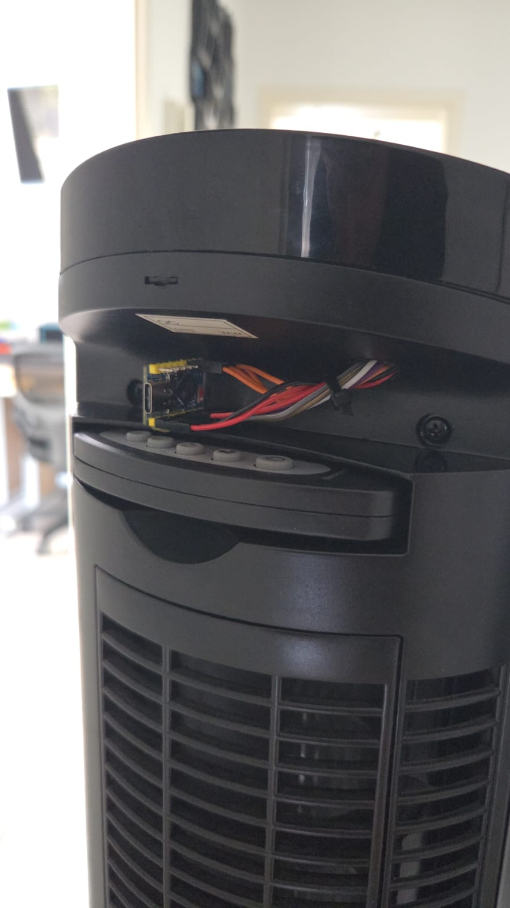

# ESP32-S3 Honeywell HO-5500RE Ventilator Smart

Smart-Home-Umbau des **Honeywell HO-5500RE Turmventilators** mit einem
**ESP32-S3-Zero**. Die originale Honeywell-Steuerplatine bleibt vollständig
erhalten: Der ESP32 simuliert die vorhandenen Taster über MOSFETs, liest die
Status-LEDs als analoges Feedback und stellt Websteuerung, Sleep-Timer,
Kalibrierung, Backup sowie OTA-Updates bereit.

> **Projektstatus:** Final / im realen Gerät eingesetzt  
> **Aktuelle Firmware:** `6.4.10-FINAL-UI-MANUAL-OSC`  
> **Controller:** ESP32-S3-Zero  
> **Upgrade von GitHub-Stand 5.0.0:** kein kompletter Hardwareumbau erforderlich



## Was sich seit 5.0.0 geändert hat

Die ursprüngliche GitHub-Version arbeitete mit **9 Profilen**
(`3 Geschwindigkeiten × 3 Modi`). Die aktuelle Firmware bildet zusätzlich
**Drehen AUS/AN** ab und arbeitet damit mit **18 vollständigen Zuständen**.

Die LED-Auswertung wurde grundlegend überarbeitet:

- phasenentkoppelte/jitternde ADC-Abtastung statt eines festen Zeitrasters
- 64-Bin-Histogramme pro LED-Kanal
- 10 CDF-Stützstellen × 5 Kanäle = **50 Verteilungsmerkmale**
- transition-balanced Training mit unterschiedlichen Vorgängerzuständen
- unabhängiger Holdout statt nur Trainingserfolg
- getrennte kontextuelle Erkennung für Speed, Modus und Drehen
- zusätzliches **OSC-LINEAR-Modell** für den Schwenkbetrieb
- robustere Normal-Modus-Erkennung über relative Kanalformen
- Kalibrierungs-/Analyseexport für Offline-Auswertung
- persistente FINAL-Profile mit CRC/A-B-Speicherung
- wiederaufnehmbare Analyse-Checkpoints
- komplett neu strukturierte Weboberfläche

Details stehen in [docs/MEASUREMENT.md](docs/MEASUREMENT.md).

## Features

- WLAN-Weboberfläche für **Ein/Aus**, **Speed 1–3**, **Drehen**,
  **Normal**, **Breeze** und **Nacht**
- elektronische Tastenbetätigung über **2N7000 N-Kanal-MOSFETs**
- fünf ADC1-Kanäle für das LED-Feedback
- **18 Zustandsprofile**:
  `3 Geschwindigkeiten × 3 Modi × Drehen AUS/AN`
- Rich-CDF-Klassifikation mit 50 Verteilungsmerkmalen
- zusätzliches OSC-LINEAR-Modell für Drehen
- Normal-Modus als primärer Praxisfall besonders robust behandelt
- Trennschärfe-Analyse mit Training, Holdout und optionalem AI-Export
- kompakter JSON-Export und optionaler Export der 64-Bin-Rohhistogramme
- persistente Kalibrierung in NVS/`Preferences`
- Backup/Import der Kalibrierung über die Weboberfläche
- Button **„Status über LEDs abgleichen“**
- **manuelle Web-Statuskorrektur**, falls der Ventilator direkt am Gerät
  oder mit der originalen Fernbedienung bedient wurde:
  - Aus / Stufe 1 / Stufe 2 / Stufe 3
  - Normal / Breeze / Nacht
  - Drehen AUS / AN
- eigener Sleep-Timer bis 4 Stunden
- Browser-OTA
- Fallback-Access-Point bei WLAN-Problemen
- optimistische Weboberfläche
- getrennte Bereiche **Steuerung** und **Einstellungen**
- ESP32/OTA sowie Kalibrierung/Backup aufgeräumt in den Einstellungen

## Grundprinzip

Der ESP32 ersetzt die originale Steuerung **nicht**. Er wird parallel an die
Taster angeschlossen und simuliert einen Tastendruck über einen 2N7000.
Die originale Bedienung am Gerät bleibt damit erhalten.

### Tasterlogik

| Taste | Funktion |
|---|---|
| Power | Ein / Aus |
| Speed | `1 → 2 → 3 → 1` |
| Drehen | Toggle AUS/AN |
| Mode | `Normal → Breeze → Nacht → Normal` |
| Original-Timer | wird nicht benutzt |

Der Sleep-Timer läuft vollständig im ESP32.

## Hardware

Benötigt werden im Kern:

- Honeywell HO-5500RE
- ESP32-S3-Zero
- 4 × 2N7000 für Power, Speed, Drehen und Mode
- gemeinsame Masse zwischen ESP32 und Honeywell-Steuerplatine
- 5-V-Versorgung für den ESP32
- Leitungen für fünf LED-Anoden
- empfohlen: Gate-Pulldown am GPIO3 / Mode

### GPIO-Belegung

| Funktion | GPIO | Anschluss |
|---|---:|---|
| Power / Taste 1 | GPIO6 | 2N7000 Gate |
| Speed / Taste 2 | GPIO5 | 2N7000 Gate |
| Drehen / Taste 3 | GPIO4 | 2N7000 Gate |
| Modus / Taste 5 | GPIO3 | 2N7000 Gate |
| LED Speed 1 | GPIO7 | LED-Anode / ADC1 |
| LED Speed 2 | GPIO8 | LED-Anode / ADC1 |
| LED Speed 3 | GPIO9 | LED-Anode / ADC1 |
| LED Breeze | GPIO10 | LED-Anode / ADC1 |
| LED Nacht | GPIO1 | LED-Anode / ADC1 |

Alle Feedback-Pins liegen bewusst auf **ADC1**.

Die genaue Verdrahtung steht in [docs/WIRING.md](docs/WIRING.md).

## Warum die LED-Rückmeldung so aufwendig ist

Die LEDs des HO-5500RE sind keine fünf einfachen digitalen HIGH/LOW-Signale.
Die originale Platine **multiplext** die Anzeigen. Dadurch sieht der ESP32 an
den Anoden eine zeitabhängige analoge Signalverteilung.

Eine feste ADC-Abtastung kann sich zufällig mit diesem Multiplexing
synchronisieren. Innerhalb eines Messlaufs sehen die Werte dann extrem stabil
aus, nach einem Neustart kann sich die Phase aber verschieben und dieselbe
Messmethode liefert andere Werte. Genau dieses Aliasing war bei älteren
Firmwaregenerationen ein zentrales Problem.

Zusätzlich liegen einige Kombinationen aus Breeze/Nacht und Drehen AUS/AN
elektrisch sehr nahe beieinander. Auch Übergangspfad, Temperatur,
Versorgungsspannung und ADC-Streuung können die Verteilung leicht verschieben.

Die aktuelle Firmware versucht deshalb **nicht**, aus einem einzelnen ADC-Wert
einen Zustand abzuleiten. Sie betrachtet Verteilungen über viele Messpunkte,
relative Kanalformen und den bereits bekannten Web-Kontext.

Mehr technische Details:
[docs/MEASUREMENT.md](docs/MEASUREMENT.md).

## Zustandsmodell

Die 18 vollständigen Zustände sind:

```text
Stufe 1 / Normal / Drehen AUS
Stufe 1 / Normal / Drehen AN
Stufe 1 / Breeze / Drehen AUS
Stufe 1 / Breeze / Drehen AN
Stufe 1 / Nacht / Drehen AUS
Stufe 1 / Nacht / Drehen AN

Stufe 2 / ... identisch

Stufe 3 / ... identisch
```

### Wichtige Designentscheidung

**Der Webzustand bleibt autoritativ.**

Die LED-Erkennung dient als Plausibilitätskontrolle und zur bewussten
Synchronisierung. Sie überschreibt einen absichtlich über die Weboberfläche
gewählten Zustand nicht automatisch.

Wenn der Ventilator außerhalb der Weboberfläche bedient wurde, gibt es zwei
Möglichkeiten:

1. **Status über LEDs abgleichen** – versucht den physischen Zustand aus den
   LEDs zu rekonstruieren.
2. **Web-Status manuell setzen** – setzt den internen Zustand direkt, ohne einen
   Taster am Ventilator auszulösen.

Gerade die zweite Variante ist absichtlich vorhanden, weil nicht jede
LED-Kombination unter allen Bedingungen mathematisch perfekt trennbar ist.

## Normal-Modus

Der Ventilator wird im realen Einsatz überwiegend in **Normal** verwendet.
Deshalb wird dieser Modus bei der Laufzeiterkennung besonders robust behandelt.

Für Speed wird im Normal-Modus stärker die relative Form der fünf LED-Kanäle
verwendet. Gemeinsame Pegelverschiebungen zwischen zwei Boot-Sessions wirken
sich dadurch weniger stark aus.

Breeze und Nacht bleiben vollständig unterstützt, dürfen bei der
Plausibilitätsdiagnose aber konservativer behandelt werden.

## Weboberfläche

### Steuerung

Die Hauptseite enthält nur Funktionen für den täglichen Betrieb:

- Speed 0–3
- Normal / Breeze / Nacht
- Drehen
- Sleep-Timer
- **Status über LEDs abgleichen**
- zugeklapptes Panel **Web-Status manuell setzen**

### Einstellungen

Technische Funktionen liegen getrennt unter **Einstellungen**:

**ESP32 & OTA**

- Firmwareversion
- IP / WLAN
- Uptime
- gespeicherter Zustand
- Kalibrierungsstatus
- OTA-Upload

**Kalibrierung & Daten**

- Trennschärfe-Analyse
- vollständige Speed-/Modus-Kalibrierung
- Live-LED-Diagnose
- Profil-/Fallback-Status
- Backup & Wiederherstellung

## Trennschärfe-Analyse

Die Analyse ist heute vor allem ein Werkzeug für neue Hardware,
Neuverdrahtung oder eine komplett neue Kalibrierung.

Der aktuelle Ablauf verwendet:

- 4 vollständige Trainingsdurchläufe
- 18 Zustände pro Durchlauf
- unterschiedliche Übergangspfade
- 2 vollständige unabhängige Holdout-Pässe
- eine dritte Messung nur für einzelne Grenzfälle

Ein vollständig abgeschlossener Lauf kann anschließend gespeichert werden,
auch wenn einzelne Diagnosewerte nicht perfekt sind. Die Qualitätsmetriken
bleiben für Export und Diagnose erhalten.

## Installation

1. Arduino IDE und ESP32-Arduino-Core installieren.
2. ESP32-S3-Zero als passendes S3-Board konfigurieren.
3. Aktuelle Datei aus [`firmware/`](firmware/) öffnen.
4. Im Kopf der `.ino` die Platzhalter ersetzen:

```cpp
const char* WIFI_SSID = "YOUR_WIFI_SSID";
const char* WIFI_PASS = "YOUR_WIFI_PASSWORD";

const char* AP_PASS   = "CHANGE_ME_AP";
const char* OTA_USER  = "admin";
const char* OTA_PASS  = "CHANGE_ME_OTA";
```

5. Erstes Update per USB flashen.
6. Danach sind OTA-Updates über die Weboberfläche möglich.

### Upgrade einer vorhandenen Installation

Beim normalen Update von einer bestehenden FINAL-Kalibrierung:

- **Erase All Flash nicht aktivieren**
- vorhandene Kalibrierungsdaten bleiben gespeichert
- kein neuer kompletter Messlauf notwendig

Gerätespezifische Kalibrierungsbackups werden bewusst **nicht** in diesem
Repository veröffentlicht.

## Verhalten nach Neustart / Stromausfall

Nach einer vollständigen Netztrennung verliert die Honeywell-Platine ihren
Zustand. Die Firmware geht deshalb von folgenden Hardware-Defaults aus:

- Ventilator AUS
- nächstes Einschalten: Stufe 1
- Normal
- Drehen AUS

Ein normaler ESP-/OTA-Neustart ist davon zu unterscheiden, weil die
Honeywell-Platine dabei weiter versorgt sein kann. Der zuletzt bekannte
Webzustand wird für diesen Fall erhalten.

## Sicherheit

Dieses Projekt verändert ein **netzbetriebenes Haushaltsgerät**.

- Nur spannungsfrei am Gerät arbeiten.
- Netzspannungsbereiche der Platine nicht berühren.
- ESP32 und Niederspannungsleitungen sicher vom Netzbereich trennen.
- ESP32-S3-GPIOs sind **nicht 5-V-tolerant**. LED-Messpunkte vor Anschluss
  elektrisch prüfen.
- USB-5-V und die 5-V-Schiene des Ventilators nicht unkontrolliert
  gegeneinander speisen.
- OTA- und Fallback-AP-Passwörter unbedingt ändern.

## Repository-Struktur

```text
ESP32-S3-Honeywell-HO-5500RE-Smart/
├── README.md
├── CHANGELOG.md
├── DESCRIPTION.txt
├── GITHUB.md
├── RELEASE_v6.4.10.md
├── PUSH_COMMANDS.md
├── .gitignore
├── firmware/
│   └── ventilator_esp32_s3_zero_FINAL_v6.4.10_UI_MANUAL_OSC.ino
└── docs/
    ├── WIRING.md
    ├── MEASUREMENT.md
    └── images/
```

## Changelog

Siehe [CHANGELOG.md](CHANGELOG.md).

---

Das Projekt begann mit dem einfachen Ziel, die originalen Taster eines
Turmventilators per ESP32 zu drücken. Der schwierigste Teil wurde am Ende nicht
die Steuerung, sondern das zuverlässige Reverse Engineering der gemultiplexten
LED-Rückmeldung.
