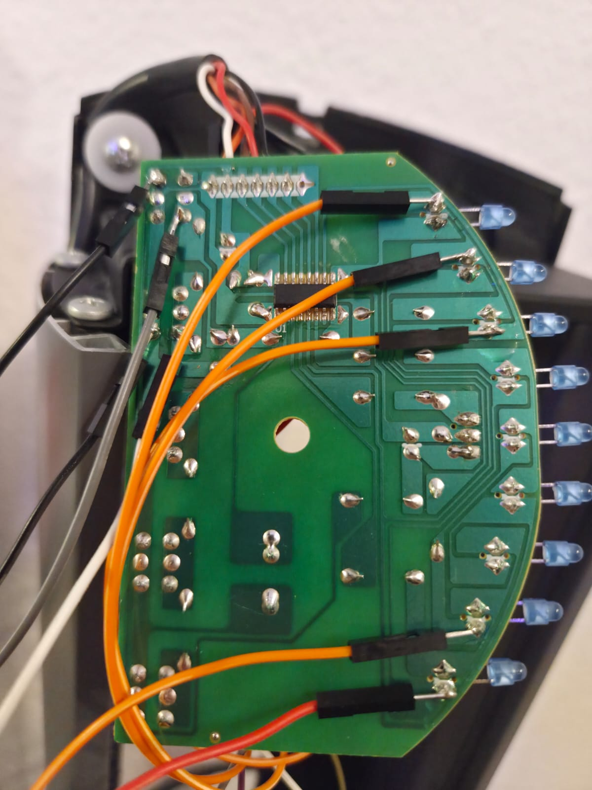
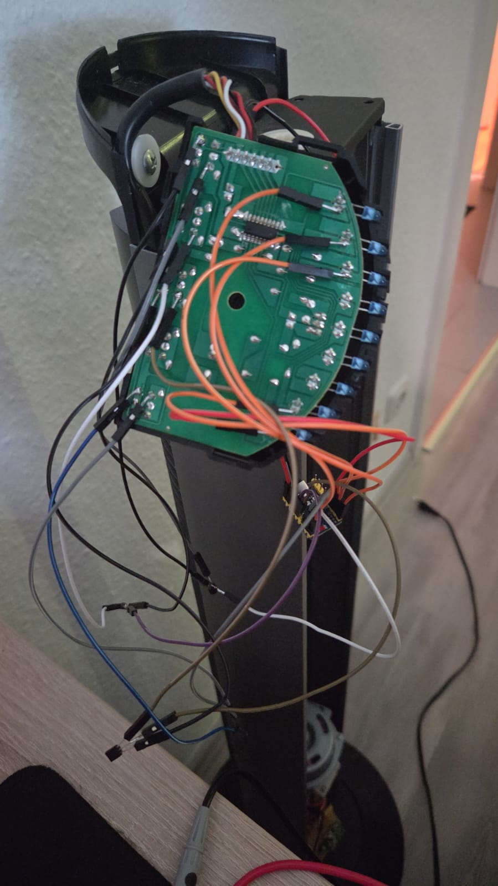

# Verdrahtung

## Tastersteuerung

Die originalen Taster bleiben erhalten. Der ESP32 simuliert einen Tastendruck
über 2N7000 N-Kanal-MOSFETs.

| Honeywell-Funktion | GPIO | Beschreibung |
|---|---:|---|
| Power | GPIO6 | Taste 1 |
| Speed | GPIO5 | Taste 2 |
| Drehen | GPIO4 | Taste 3 |
| Modus | GPIO3 | Taste 5 |

Taste 4 / Original-Timer wird nicht benutzt.

### 2N7000

Für die im Projekt verwendete TO-92-Bauform gilt bei Blick auf die **flache
Seite**:

```text
links     Mitte     rechts
Source    Gate      Drain
```

Verdrahtung:

- Source → gemeinsamer GND
- Gate → ESP32-GPIO
- Drain → entsprechende Tasterleitung

Vor dem Einlöten trotzdem das Datenblatt des konkret verwendeten Bauteils
prüfen.

GPIO3 ist ein Strapping-Pin des ESP32-S3. Ein Gate-Pulldown ist empfehlenswert.

## LED-Feedback

| Status | GPIO | Messpunkt |
|---|---:|---|
| Speed 1 | GPIO7 | LED1 Anode |
| Speed 2 | GPIO8 | LED2 Anode |
| Speed 3 | GPIO9 | LED3 Anode |
| Breeze | GPIO10 | LED8 Anode |
| Nacht | GPIO1 | LED9 Anode |

Die Feedback-Pins liegen auf ADC1.

Die LED-Signale werden gemultiplext und sind deshalb **nicht** als einfache
digitale HIGH/LOW-Signale zu verstehen. Details:
[MEASUREMENT.md](MEASUREMENT.md).

## Elektrische Sicherheit der ADC-Eingänge

ESP32-S3-GPIOs sind nicht 5-V-tolerant.

Vor dem direkten Anschluss eines LED-Messpunktes muss deshalb geprüft werden,
welche Spannung dort gegen den gemeinsamen GND tatsächlich auftritt. Bei einem
abweichenden Platinenstand gegebenenfalls geeignete Pegelanpassung verwenden.

Die aktuelle Softwarekalibrierung setzt die bestehende, im Projekt getestete
Messverdrahtung voraus. Nach Änderung des analogen Frontends müssen die Profile
neu gelernt werden.

## Versorgung

ESP32 und Steuerplatine benötigen gemeinsamen GND.

Der ESP32-S3-Zero wird im finalen Aufbau aus der vorhandenen 5-V-Schiene
versorgt.

**Achtung:** Ohne geeignete Entkopplung USB-5-V nicht gleichzeitig mit der
5-V-Versorgung des Ventilators verbinden.

## Übersicht

```text
Honeywell T1 Power  ---- Drain 2N7000
                              Source ---- GND
ESP GPIO6 ------------------- Gate

Honeywell T2 Speed  ---- Drain 2N7000
ESP GPIO5 ------------------- Gate

Honeywell T3 Drehen ---- Drain 2N7000
ESP GPIO4 ------------------- Gate

Honeywell T5 Mode   ---- Drain 2N7000
ESP GPIO3 ------------------- Gate

LED Speed1 Anode ---------------- GPIO7
LED Speed2 Anode ---------------- GPIO8
LED Speed3 Anode ---------------- GPIO9
LED Breeze Anode ---------------- GPIO10
LED Nacht Anode ----------------- GPIO1

Honeywell GND -------------------- ESP GND
Honeywell 5 V -------------------- ESP 5 V
```




